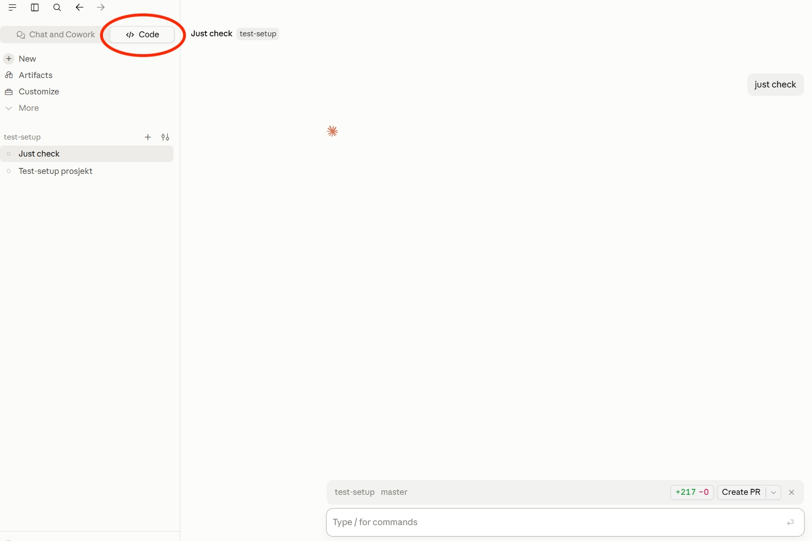

# Sjekk maskinen din før workshopen

Denne sjekken tar noen få minutter. Den sjekker at du har nødvendig programvare installert før
workshop starter. Send resultatet av sjekken til koordinator i din bedrift for Agentic Edge
workshop, se lenger ned.

## Før du starter

Følg først [installation-guide.md](installation-guide.md) og installer VS Code, Git og Node.js.
Guiden dekker både Windows og Mac. På Windows viser [git-install.md](git-install.md) deg hvert
valg i Git-installasjonen.

Du må også ha Claude (Desktop applikasjon, _ikke_ websiden claude.ai) med tilgang til Claude Code,
og du må være logget inn i Claude.

## Slik gjør du det

1. Åpne Claude. Klikk **Code** øverst til venstre, ved siden av «Chat and Cowork».

   

2. Lim inn og send denne meldingen i en ny chat.

   På **Windows**:

```
Klon https://github.com/akselh/test-setup til C:\dev\workshop-setup-test.
Bytt arbeidsmappe til C:\dev\workshop-setup-test.
Kjør pre-workshop-check skillen.
```

   På **Mac**:

```
Klon https://github.com/akselh/test-setup til ~/dev/workshop-setup-test.
Bytt arbeidsmappe til ~/dev/workshop-setup-test.
Kjør pre-workshop-check skillen.
```
3. Claude spør deg om navnet ditt. Svar på spørsmålet.
4. Send filen som blir laget til din workshop koordinator. Se instruksjoner under.

Claude gjør all sjekk. NB! Sjekken bruker en egen `dev`-mappe, ikke `Dokumenter`. Mappen
`Dokumenter` ligger ofte i OneDrive eller iCloud, og det kan gi feil.

### Dette gjør du med resultatet av sjekken

Send filen som starter med `pre-workshop-check-` til koordinator for Agentic Edge workshops i din
bedrift.

## Hva sjekken gjør på maskinen din

Sjekken leser først om Node.js, Git og VS Code er installert. Deretter lager den en Word-fil og en
PowerPoint-fil, for å vise at eksporten virker.

Sjekken skriver fire ting, alle i den nye mappen på disken din. Mappen heter
`C:\dev\workshop-setup-test` på Windows og `~/dev/workshop-setup-test` på Mac:

- `word-example.docx`, en Word-fil laget fra `word-example.md`.
- `powerpoint-example.pptx`, en PowerPoint-fil laget fra `powerpoint-example.md`.
- `node_modules`, en mappe med kode som Word- og PowerPoint-testen trenger.
- `pre-workshop-check-<navnet ditt>.md`, rapporten du sender til koordinator.

Alle fire kan du slette etterpå. Ingen av dem ligger utenfor mappen.

Sjekken installerer ingen programmer. Sjekken kan endre to ting, og den spør deg først:

- PATH-en din, hvis Node.js eller Git ligger på disken, men Claude ikke finner dem.
- Navnet og e-postadressen din i Git, hvis du ikke har satt dem fra før.
