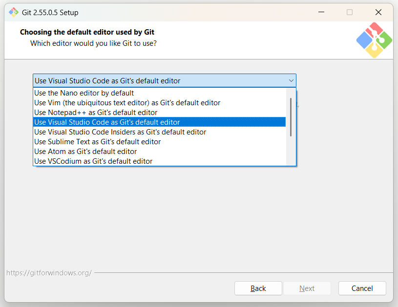
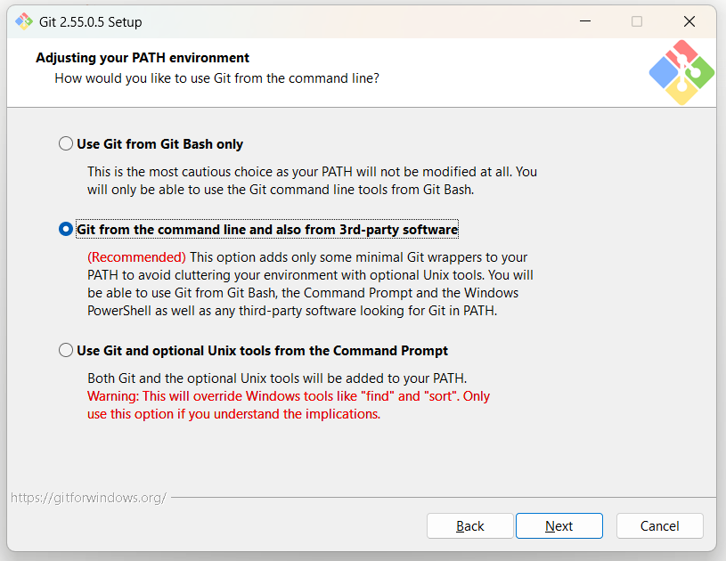
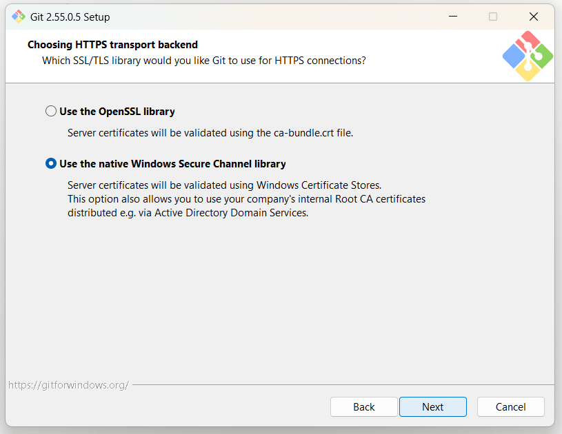
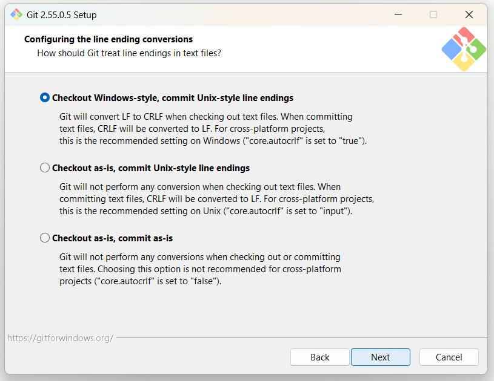
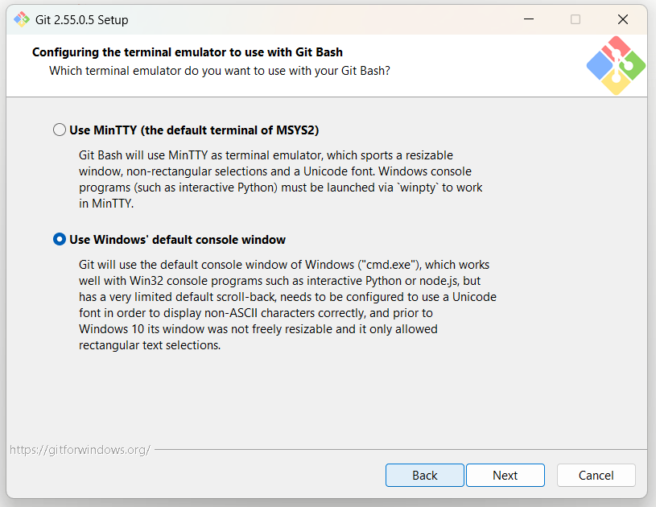
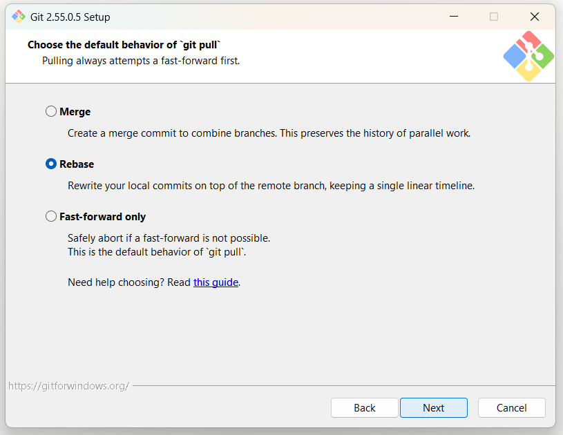
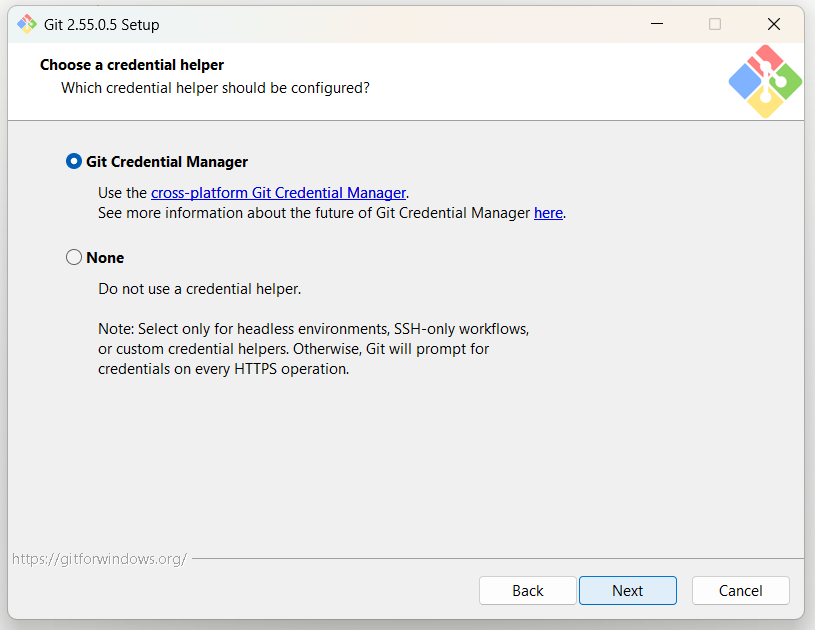
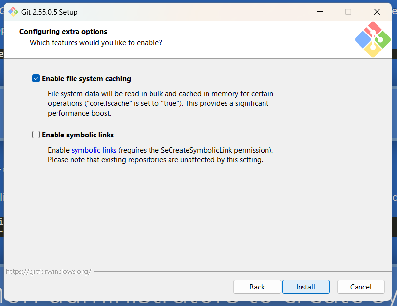

# Installer Git for Windows

Denne siden viser deg hvert valg i Git-installasjonen, steg for steg. Du trenger
den bare på Windows. På Mac stiller installasjonsprogrammet ingen av disse
spørsmålene.

Last ned Git herfra: https://git-scm.com/download/win. Denne siden bruker Git
versjon 2.55.0.5. Start installasjonsprogrammet etter nedlastingen.

## Rask installasjon uten spørsmål

Denne delen er for deg som er trygg på PowerShell. Du får nøyaktig de åtte valgene
lenger nede, i én kommando. Hopper du over denne delen, skjer ingenting galt.

Last ned installasjonsfilen først. Åpne så PowerShell i mappen der filen ligger, og
lim inn:

```
.\Git-2.55.0.5-64-bit.exe /VERYSILENT /NORESTART `
  /o:EditorOption=VisualStudioCode `
  /o:PathOption=Cmd `
  /o:CURLOption=WinSSL `
  /o:CRLFOption=CRLFAlways `
  /o:BashTerminalOption=ConHost `
  /o:GitPullOption=Rebase `
  /o:CredentialManagerOption=Enabled `
  /o:EnableSymlinks=Disabled
```

Hvert flagg svarer på ett skjermbilde lenger nede:

| Flagg | Skjermbilde |
| --- | --- |
| `EditorOption=VisualStudioCode` | 1. Standard tekstredigerer |
| `PathOption=Cmd` | 2. PATH-innstilling |
| `CURLOption=WinSSL` | 3. HTTPS-bibliotek |
| `CRLFOption=CRLFAlways` | 4. Linjeskift |
| `BashTerminalOption=ConHost` | 5. Terminalemulator |
| `GitPullOption=Rebase` | 6. Oppførsel for git pull |
| `CredentialManagerOption=Enabled` | 7. Innloggingshjelper |
| `EnableSymlinks=Disabled` | 8. Ekstra valg |

Filnavnet endrer seg med versjonen. Bytt `Git-2.55.0.5-64-bit.exe` med navnet på
filen du lastet ned.

Kommandoen viser ingenting mens den kjører. Vent til ledeteksten kommer tilbake.
Sperrer firmaet ditt skript i PowerShell, feiler kommandoen. Da bruker du de åtte
skjermbildene lenger nede.

## Installer med skjermbildene

De første skjermbildene heter velkomst, lisens, installasjonsmappe, komponenter
og startmeny-mappe. Behold standardvalget på alle disse, og klikk «Next».
Deretter kommer de åtte valgene under.

Alle skjermbilder som ikke er nevnt her, beholder standardvalget. Klikk «Next»
på dem.

## 1. Standard tekstredigerer (Choosing the default editor used by Git)

Skjermen spør: «Which editor would you like Git to use?»

Velg **Use Visual Studio Code as Git's default editor** i nedtrekkslisten.



Listen viser også Nano, Vim, Notepad++, VS Code Insiders, Sublime Text, Atom og
VSCodium. Workshopen bruker VS Code. Vim er vanskelig å komme ut av for en ny
bruker.

## 2. PATH-innstilling (Adjusting your PATH environment)

Skjermen spør: «How would you like to use Git from the command line?»

Velg **Git from the command line and also from 3rd-party software**. Dette
alternativet er merket «(Recommended)» og er forhåndsvalgt.



> **VIKTIG:** Dette er det viktigste valget i hele installasjonen. Claude Code
> må finne `git` på PATH-en. Velger du «Use Git from Git Bash only», legges
> Git ikke på PATH-en. Da feiler sjekken før workshopen.

De andre alternativene er «Use Git from Git Bash only» og «Use Git and
optional Unix tools from the Command Prompt».

## 3. HTTPS-bibliotek (Choosing HTTPS transport backend)

Skjermen spør: «Which SSL/TLS library would you like Git to use for HTTPS
connections?»

Velg **Use the native Windows Secure Channel library**.



Det andre alternativet er «Use the OpenSSL library». På en firmamaskin ligger
firmaets sertifikater i Windows sitt sertifikatlager. Dette valget lar Git
bruke dem.

## 4. Linjeskift i tekstfiler (Configuring the line ending conversions)

Skjermen spør: «How should Git treat line endings in text files?»

Velg **Checkout Windows-style, commit Unix-style line endings**. Dette er
standardvalget.



De andre alternativene er «Checkout as-is, commit Unix-style line endings» og
«Checkout as-is, commit as-is».

## 5. Terminalemulator (Configuring the terminal emulator to use with Git Bash)

Skjermen spør: «Which terminal emulator do you want to use with your Git
Bash?»

Velg **Use Windows' default console window**.



Det andre alternativet er «Use MinTTY (the default terminal of MSYS2)».
Windows-konsollen fungerer med node.js og med interaktive programmer.

## 6. Standardoppførsel for git pull (Choose the default behavior of `git pull`)

Velg **Rebase**.



De andre alternativene er «Merge» og «Fast-forward only». Rebase holder
historikken som én rett linje.

## 7. Innloggingshjelper (Choose a credential helper)

Skjermen spør: «Which credential helper should be configured?»

Velg **Git Credential Manager**. Dette er standardvalget.



Det andre alternativet er «None». Med Git Credential Manager logger du inn én
gang, og Git husker innloggingen.

## 8. Ekstra valg (Configuring extra options)

Skjermen spør: «Which features would you like to enable?»

Behold **Enable file system caching** PÅ (haket av, standardvalget). Behold
**Enable symbolic links** AV (ikke haket av, standardvalget).



Knappen på denne skjermen heter «Install», ikke «Next». Klikk «Install» for å
starte installasjonen.

Det siste skjermbildet kan spørre om eksperimentelle valg. Slå av alle disse
valgene.

## Etter installasjonen

Git trenger et navn og en e-postadresse før Git kan lagre en endring.
Sjekken før workshopen setter dette opp for deg, og spør deg om navn og
e-post.

Vil du sette opp navn og e-post selv, bruker du disse to kommandoene:

```
git config --global user.name "Ditt Navn"
git config --global user.email "din.epost@bedrift.no"
```

Start maskinen på nytt etter installasjonen, eller logg ut og inn igjen. Først
da ser alle programmer Git på PATH-en. Claude Desktop som kjørte under
installasjonen, beholder den gamle PATH-en.
